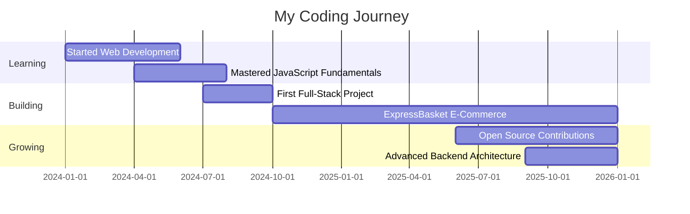

<div align="center">

<!-- Professional Header Banner -->


<!-- Dynamic Typing Animation with Professional Colors -->


<br/>

<!-- Professional Badges -->
[](https://github.com/Jeet1511?tab=followers)
[](https://github.com/Jeet1511)
[](https://www.instagram.com/_echo.del.alma_?igsh=MTFocmpxYW03em94aA==)

</div>

<br/>

<!-- Terminal-Style About Me -->
## 💻 **$ whoami**

```bash
$ cat developer.profile

┌─────────────────────────────────────────────────────────────┐
│  JEET MONDAL - Full Stack Developer                        │
├─────────────────────────────────────────────────────────────┤
│  📍 Location: India 🇮🇳                                     │
│  💼 Expertise: Transforming ideas into production-ready     │
│               web applications                              │
│  🎯 Specializing: Modern JavaScript frameworks &           │
│                   scalable backends                         │
│  ⚡ Philosophy: Every commit is a step toward better       │
│                software                                     │
└─────────────────────────────────────────────────────────────┘

$ ls current_focus/
  > 🛒 ExpressBasket/     (E-Commerce Platform - 235+ deployments)
  > 🛍️  basket/           (Shopping Application)
  > 📚 Advanced Backend Architecture
  > 🤝 Open Source Contributions

$ cat fun_facts.txt
  > ☕ Powered by coffee and curiosity
  > 🐛 I debug with console.log() and I'm proud of it!
  > 🚀 Turning bugs into features since 2024
```

<br/>

<!-- Current Status Panel -->
<div align="center">

### 🎯 **Currently**

<table>
<tr>
<td width="50%" valign="top">

#### 💼 **Working On**
🛒 ExpressBasket E-Commerce Platform  
🎨 Building Intuitive User Interfaces  
🔧 Scalable Backend Architecture

</td>
<td width="50%" valign="top">

#### 📚 **Learning**
⚡ Advanced Node.js Patterns  
🎭 UI/UX Design Principles  
🔐 Web Security Best Practices

</td>
</tr>
<tr>
<td width="50%" valign="top">

#### 🤝 **Open To**
💡 Collaborations & Partnerships  
🚀 Freelance Opportunities  
🎓 Knowledge Exchange

</td>
<td width="50%" valign="top">

#### ⚡ **Fun Fact**
☕ Debug sessions powered by coffee  
🌙 Peak productivity: Late night coding  
🎯 Goal: Build impactful solutions

</td>
</tr>
</table>

</div>

<br/>

<!-- Developer Journey Timeline -->
<details>
<summary><b>🚀 My Developer Journey</b> (Click to expand)</summary>
<br/>



**The Journey So Far:**

- **2024** 🌱 Started web development journey - Built foundation in HTML, CSS, JavaScript
- **2024-2025** 🚀 Developed first full-stack e-commerce platform (ExpressBasket)
- **2025** 💡 Mastered Node.js, Express, and modern development tools
- **2026** 🎯 Contributing to open source, expanding backend expertise, building scalable solutions

</details>

<br/>

<!-- Achievement Wall -->
<div align="center">

## 🏆 **Achievement Wall**

```ascii
╔══════════════════════════════════════════════════════════════╗
║                    🎯 DEVELOPER STATS                        ║
╠══════════════════════════════════════════════════════════════╣
║  ⭐ Total Stars Earned          │  5+                        ║
║  🚀 Active Projects             │  4                         ║
║  💻 Commits This Year           │  142+                      ║
║  📦 Deployments (ExpressBasket) │  235+                      ║
║  🔥 Coding Streak               │  Building Daily            ║
║  🤝 Collaborations              │  Growing                   ║
╚══════════════════════════════════════════════════════════════╝
```

</div>

<br/>

<!-- Tech Stack with Professional Styling -->
## 🛠️ **Tech Stack & Expertise**

<div align="center">

### **Languages & Core Technologies**


### **Frameworks & Libraries**


### **Databases & Tools**


</div>

<br/>

<!-- Skill Proficiency -->
<details>
<summary><b>📊 Skill Proficiency Levels</b> (Click to expand)</summary>
<br/>

<div align="center">

| Technology | Proficiency | Experience |
|------------|-------------|------------|
| JavaScript | ⭐⭐⭐⭐⭐ | Advanced - 2+ years |
| Node.js & Express | ⭐⭐⭐⭐⚪ | Intermediate - Production apps |
| HTML & CSS | ⭐⭐⭐⭐⭐ | Advanced - Responsive design |
| Python & Flask | ⭐⭐⭐⚪⚪ | Intermediate - Web applications |
| MongoDB | ⭐⭐⭐⭐⚪ | Intermediate - Database design |
| Git & GitHub | ⭐⭐⭐⭐⚪ | Intermediate - Version control |
| Tailwind CSS | ⭐⭐⭐⭐⚪ | Intermediate - Modern styling |

</div>

</details>

<br/>

<!-- GitHub Statistics Dashboard -->
## 📊 **Developer Dashboard**

<div align="center">

### **GitHub Analytics**

 
  


</div>

<br/>

<!-- Activity Graph -->
<div align="center">

### **Contribution Activity**
  
[](https://github.com/Jeet1511)

</div>

<br/>

<!-- Featured Projects Portfolio -->
## 🚀 **Featured Projects Portfolio**

<div align="center">

<table>
<tr>
<td width="50%" valign="top">

### 🛒 **ExpressBasket**
[](https://github.com/Jeet1511/ExpressBasket)

**Modern E-Commerce Platform**

A full-stack e-commerce solution with a focus on user experience and scalability.

**🔧 Tech Stack:**  


**📈 Impact:**
- 🚀 **235+ Successful Deployments**
- ⚡ Optimized performance & UX
- 🛡️ Secure payment integration ready

</td>
<td width="50%" valign="top">

### 🛍️ **basket**
[](https://github.com/Jeet1511/basket)

**Shopping Basket Application**

A responsive shopping cart implementation with modern UI/UX.

**🔧 Tech Stack:**  


**📈 Features:**
- 🎨 Responsive design
- ⚡ Dynamic cart management
- 💡 Clean, maintainable code

</td>
</tr>
<tr>
<td width="50%" valign="top">

### 🔐 **HTML-Login-Page-Test**
[](https://github.com/Jeet1511/HTML-Login-Page-Test)

**Authentication UI Testing**

Professional login page implementation for testing and learning.

**🔧 Tech Stack:**  


**⭐ Recognition:**
- ⭐ **3 GitHub Stars**
- 🎨 Clean UI design
- 🔒 Security-focused approach

</td>
<td width="50%" valign="top">

### 🐍 **ff-likes-v3**
[](https://github.com/Jeet1511/ff-likes-v3)

**Python Web Application**

Flask-based web application demonstrating Python backend skills.

**🔧 Tech Stack:**  


**📈 Features:**
- 🐍 Python backend
- ⚡ Flask framework
- 🔧 RESTful API design

</td>
</tr>
</table>

</div>

<br/>

<!-- Let's Build Something Together -->
## 🤝 **Let's Build Something Amazing Together**

<div align="center">

<table>
<tr>
<td align="center" width="33%">

### 💼 **Professional**
[](https://github.com/Jeet1511)

**Follow my journey**  
View projects & contributions

</td>
<td align="center" width="33%">

### 📧 **Contact**
[](mailto:jeetmondal1685@gmail.com)

**Let's connect**  
Collaborations welcome!

</td>
<td align="center" width="33%">

### 🌟 **Social**
[](https://www.instagram.com/_echo.del.alma_?igsh=MTFocmpxYW03em94aA==)

**Beyond code**  
Creative connections

</td>
</tr>
</table>

<br/>

### 💬 **Open to:**
```
💡 Innovative Project Collaborations
🚀 Freelance Development Opportunities  
🎓 Knowledge Sharing & Mentorship
☕ Virtual Coffee Chats About Tech
```

</div>

<br/>

<!-- Inspirational Section -->
<div align="center">

## 💭 **Daily Inspiration**


<br/>

### 💡 *"Every great developer you know got there by solving problems they were unqualified to solve until they actually did it."*

</div>

<br/>

<!-- Footer -->
<div align="center">

---


**⭐ If you find my work interesting, consider starring my repositories!**

<sub>Built with ❤️ and lots of ☕ by Jeet Mondal</sub>

<sub>*Last Updated: January 2026 | Continuously evolving...*</sub>

</div>
