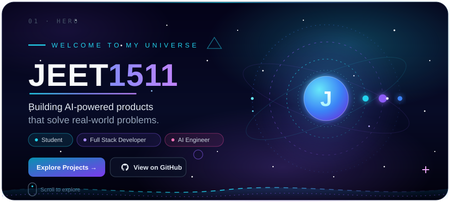
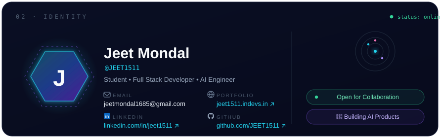
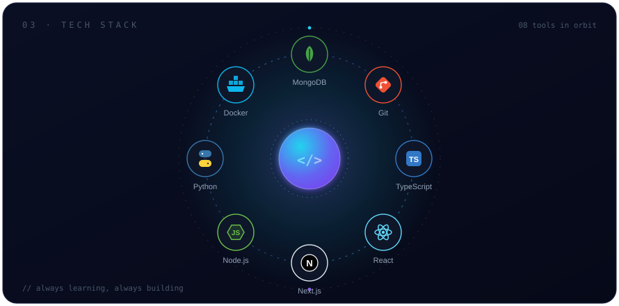
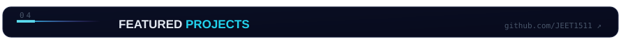
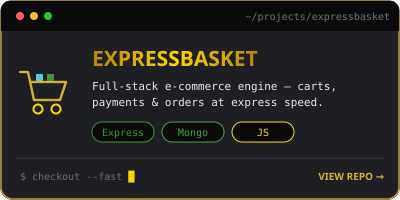
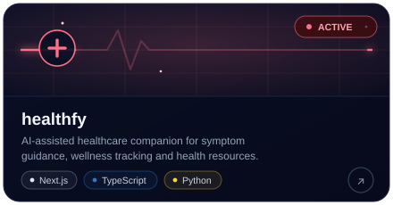
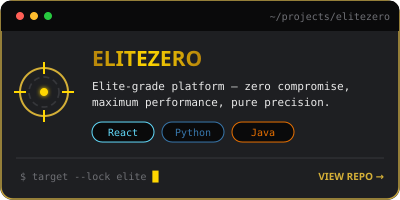
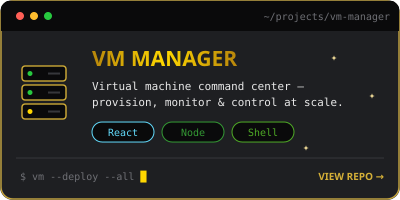
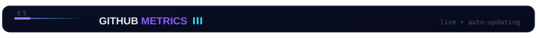

<!-- 01 · HERO -->

<!-- 02 · IDENTITY -->

<!-- 03 · TECH STACK -->

<!-- 04 · FEATURED PROJECTS -->

<!-- 05 · GITHUB METRICS -->

<picture>
  <source media="(prefers-color-scheme: dark)" srcset="https://raw.githubusercontent.com/JEET1511/jeet1511/output/github-contribution-grid-snake-dark.svg"/>
  <source media="(prefers-color-scheme: light)" srcset="https://raw.githubusercontent.com/JEET1511/jeet1511/output/github-contribution-grid-snake.svg"/>
  
</picture>

<!-- FIN -->

