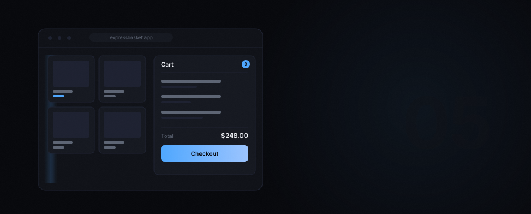
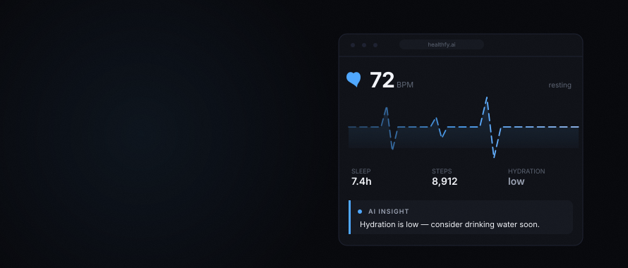
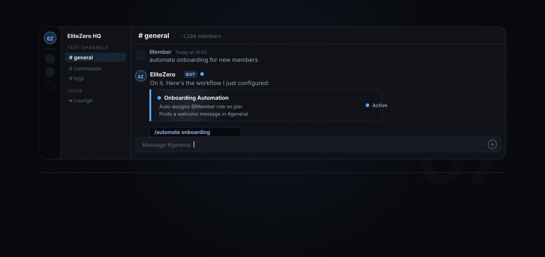
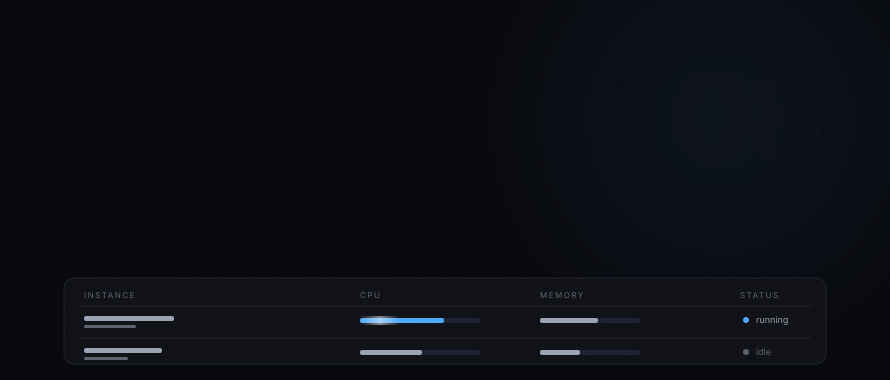
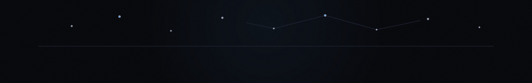

<a href="https://jeet1511.indevs.in/jeet1511">Portfolio</a>
&nbsp;&#183;&nbsp;
<a href="https://www.linkedin.com/in/jeet1511">LinkedIn</a>
&nbsp;&#183;&nbsp;
<a href="mailto:jeetmondal1685@gmail.com">Email</a>
&nbsp;&#183;&nbsp;
<a href="https://github.com/JEET1511">GitHub</a>

